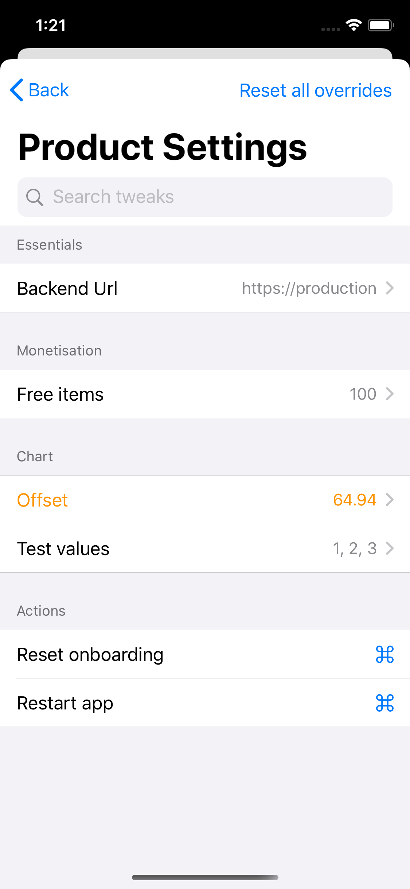
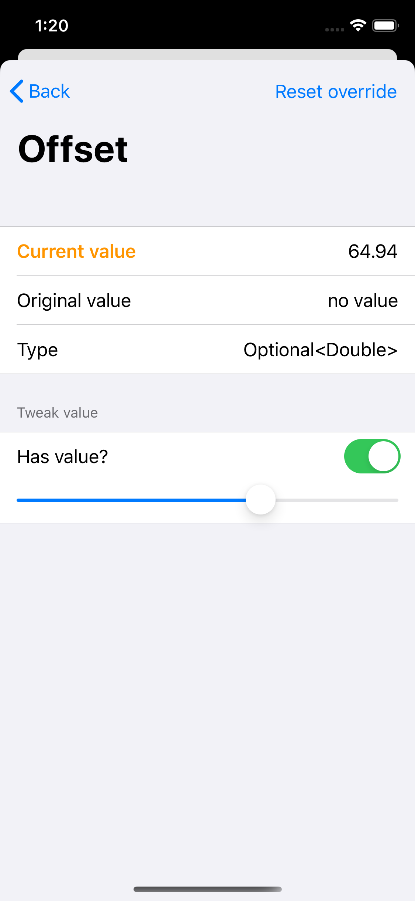

# Tweaks

  * [Tweaks](#tweaks)
    + [Overview](#overview-1)
    + [Usage](#usage-1)
      - [Tweaks UI](#tweaks-ui)
      - [Registering tweaks](#registering-tweaks)
      - [Cusotm actions](#custom-actions)
      - [Custom views](#custom-views)
      - [Custom types](#custom-types)
  * [License](#license)

## Overview

Tweaks is the powerful and visible part of configuration management.

With the use of SwiftUI, it's easy to define custom views for each data types.

Please check out the other repository [Configs](https://github.com/tevelee/Configs) to see how they integrate with each other.

## Usage

### Tweaks UI

All you need is to show the `TweaksView` SwiftUI view in any way. Usually shaking the device or having a secret settings menu option opens up these internal config menus.

```swift
import SwiftUI
import ConfigTweaks

struct ContentView: View {
    @State var showTweaks = false
    
    var body: some View {
        VStack {
            Spacer()
            Text("Hello!")
            Spacer()
            Button(action: { self.showTweaks = true }) {
                Text("Open Tweaks")
            }
            Spacer()
        }
        .sheet(isPresented: $showTweaks) {
            TweaksView()
        }
    }
}
```




Orange values represent overrides.

### Registering tweaks

As shown in the repository [Configs](https://github.com/tevelee/Configs), it's easy to use them with `ConfigDefiniton`s, but Tweaks is also usable as a standalone library.

```swift
let tweak = TweakDefinition(name: "Number of items", initialValue: 1)
TweakRepository.shared.add(tweak: tweak, category: "Product Settings", section: "Feature Settings")
``` 

You can also specify how your data should be represented in SwiftUI with renderer objects:

```swift
let tweak = TweakDefinition(name: "Number of items", initialValue: 1, valueRenderer: InputAndStepperRenderer())
let tweak = TweakDefinition(name: "Number of items", initialValue: 1, valueRenderer: SliderRenderer())
let tweak = TweakDefinition(name: "Number of items", initialValue: 1, valueRenderer: CustomRenderer(previewView: { Text(String($0)) }, tweakView: { Stepper("", value: $0) }))
```

Of course, TweakRepository is an `ObservableObject` so you can use it easily in SwiftUI as well. See the example app for more details.

### Custom actions

The system allows you to add actions, which are only tappable buttons in the Tweaks UI that perform any custom logic.

```swift
let resetAction = TweakAction(category: "Product Settings", section: "Actions", name: "Reset onboarding") {
    print("reset")
}

TweakRepository.shared.add(resetAction)
```

### Custom views

You can compose renderers to show different UIs for the same type of data, for example when you need users to pick from a predefined list of values.

```swift
let backendBaseUrl = ConfigDefinition(defaultValue: "https://production.url")
	.firebaseRemoteConfig(key: "server_url")
    .tweak(category: "Product Settings", section: "Essentials", name: "Backend Url", renderer: PickerRendererWithCustomValue(options: ["Debug": "https://debug.url", "Production": "https://production.url", "Test": "https://preprod.url"], renderer: StringTextfieldRenderer()))
```

The possibilities are endless, you can write different custom renderers upon the built-in ones provided by the library.

There are a few ones provided for common use-cases:

* `ToggleBoolRenderer` and `SegmentedBoolRenderer` for Bools
* `InputAndStepperRenderer` and `SliderRenderer` for numbers
* `StringTextfieldRenderer` for String
* `PickerRenderer` and `PickerRendererWithCustomValue` are generic composite renderers if you have a predefined set of values (of any type) to choose from
* `OptionPickerRenderer` for enums
* `ArrayRenderer` for generic array of types
* `OptionalToggleRenderer` for optional values of generic types

### Custom types

For any custom representation you need, all you need to write is a struct that conforms to `ViewRenderer` protocol, as follows:

```swift
struct StringTextfieldRenderer: ViewRenderer {
    func previewView(value: String) -> some View {
        Text(value)
    }
    func tweakView(value: Binding<String>) -> some View {
        TextField("", text: value)
            .autocapitalization(.none)
            .disableAutocorrection(true)
    }
}
```

# License

See the [LICENSE](LICENSE.md) file for license rights and limitations (MIT).